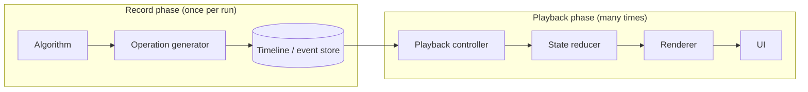
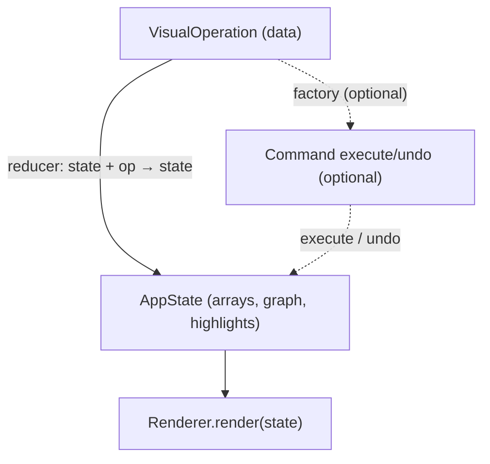
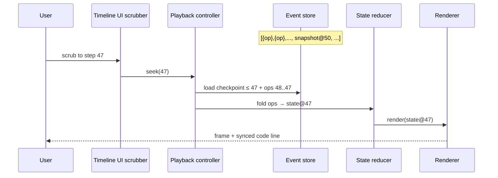
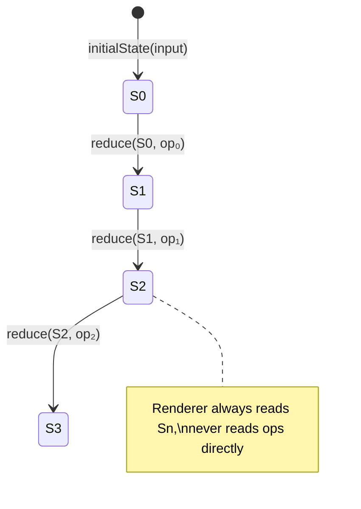
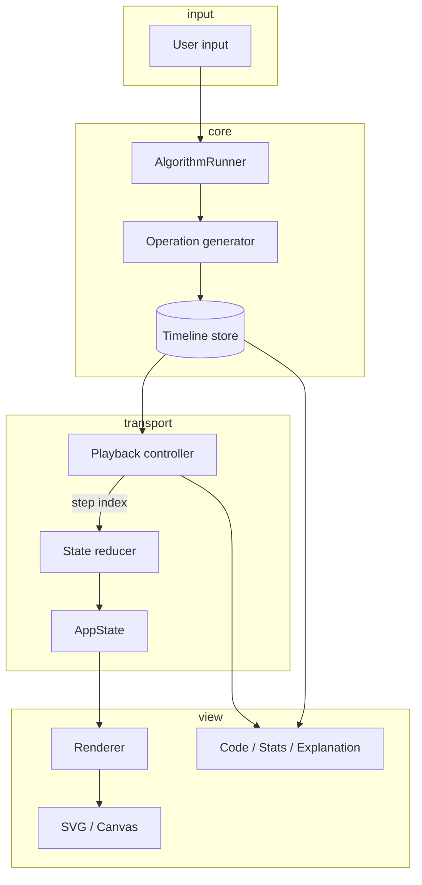
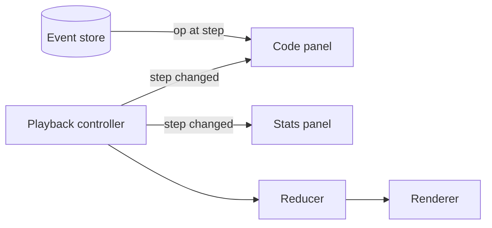

# Algorithm Visualizer — Architecture & Engineering Plan

## Vision

Build a highly extensible algorithm and data structure visualizer similar to Visualgo, supporting:

- Arrays
- Linked Lists
- Stacks / Queues
- Trees
- Graphs
- Sorting Algorithms
- Pathfinding Algorithms
- Dynamic Programming
- String Algorithms
- Heaps
- Tries
- Hash Tables
- Backtracking
- Competitive Programming style demonstrations

Core playback features:

- Play
- Pause
- Step Forward
- Step Backward
- Rewind
- Fast Forward
- Timeline Scrubbing
- Variable Speed
- Jump to Step
- Replay
- Code Highlighting
- Explanation Panels
- Input Editing
- Random Input Generation

---

# 1. High-Level Architecture

Recommended architecture:

```text
Algorithms
    ↓
Operation Generator
    ↓
Timeline / Event Store
    ↓
Playback Controller
    ↓
State Reducer
    ↓
Renderer
    ↓
UI
```

This separates:

- Logic
- Playback
- Rendering
- User interaction

This is the most scalable approach.

### Architecture clarifications (read this first)

The stack diagram names **roles**, not always separate classes. One module can own more than one role early on; split them when rewind, scrubbing, or multiple renderers force it.

#### What each layer actually does

| Layer | Role | What it is *not* |
| --- | --- | --- |
| **Algorithms** | Domain logic only: given input, describe *what happened* as data (`VisualOperation[]` or a generator). | Does not touch DOM, canvas, or playback clock. |
| **Operation generator** | Engine boundary: run the algorithm once, normalize ops, assign step indices, optionally attach explanations. | Not a second algorithm; it is *how* the engine collects the stream (see below). |
| **Timeline / event store** | Append-only recording of ops + periodic **state snapshots** (checkpoints). Single source of truth for step index, rewind, code highlight, stats. | Not the timeline *UI* widget; the UI scrubber *reads* this store. |
| **Playback controller** | Clock + transport: play, pause, step, seek, speed. Emits “current step = N” (and maybe “op at N”). | Does not render and does not implement swap/compare logic. |
| **State reducer** | Pure function: `(state, operation) → state`. Folds one op into the canonical visualization model. | Not the renderer; does not draw pixels. |
| **Renderer** | `(state) → DOM/SVG/canvas`. Idempotent view of current state. | Does not run algorithms or decide step N. |
| **UI** | Chrome: toolbar, scrubber, code panel, input forms. Subscribes to playback + state. | Should not mutate visualization state except via “run algorithm” / “edit input”. |

#### Why “operation generator” if algorithms already emit operations?

Algorithms **produce** operations; the **generator** is the **recording phase** of the engine:

1. **Separation of concerns** — `bubbleSort.generate(input)` stays testable and free of timeline/checkpoint policy.
2. **One place for cross-cutting work** — step IDs, complexity counters, human-readable explanations, validation, compression.
3. **Two execution modes** — same interface whether the algorithm returns a full array upfront or yields ops lazily (generator/async iterator for huge traces).



You do **not** need two different “algorithm” systems. Think: **algorithm = author**, **generator = publisher**, **store = archive**.

#### Operations vs commands vs renderer

- **Visual operations** — serializable **data** (`{ type: "swap", a: 0, b: 1 }`). What gets stored in the timeline.
- **Commands** (optional) — **behavior** with `execute` / `undo` on state. Useful when inverse ops are hard; can be created **from** operations in a small factory when playback starts.
- **Reducer** — the default path: apply one **operation** to **state** with pure rules (no Command class required for MVP).



**Commands do not talk to the renderer directly.** Neither do raw operations. Flow is always:

`operation → reducer → state → renderer`.

The playback controller only advances the step pointer (and triggers reducer + render); it does not map ops to draw calls.

#### What is the timeline / event store?

The **canonical list of steps** the product can rewind through — plus checkpoints for fast seek:



Store contents (conceptual):

```ts
{
  operations: VisualOperation[],   // or interleaved with snapshots
  checkpoints: { step: number, state: AppState }[],
  metadata: { algorithmId, input, explanations? }
}
```

Rewind = **replay ops from nearest checkpoint** (or undo commands), not “remember previous frames” in the renderer.

#### What does the state reducer do?

It is the **only** place that turns “what the algorithm said” into “what the picture should show”:



Example responsibilities:

- `swap` → update array values in `AppState`
- `highlight` → set `highlightedIndices`
- `visit` (graph) → mark node visited, push to traversal order
- Does **not** animate, layout SVG, or handle keyboard — that stays in renderer/UI

For **seek** to step N: `state = fold(initial, ops[0..N])` starting from latest checkpoint ≤ N.

#### End-to-end data flow



#### Observer pattern (UI only)

Playback and store updates can **notify** panels; render path stays reducer → renderer:



---


# 2. Recommended Tech Stack

## Core

- TypeScript
- HTML
- CSS

## Rendering

### Option A — SVG (Recommended Initially)

Best for:

- Trees
- Graphs
- Arrows
- Interactive nodes
- Labels
- Accessibility

Pros:

- Easy interactivity
- DOM-based
- Easier animations
- Easier debugging
- Better accessibility

Cons:

- Can become slow with thousands of nodes

---

### Option B — Canvas

Best for:

- Massive graphs
- High-performance animations
- Dense visualizations

Pros:

- Very fast rendering
- Lower memory overhead

Cons:

- Manual hit detection
- Harder accessibility
- More complex interaction logic

---

### Option C — Hybrid

Use:

- SVG for most structures
- Canvas for large scenes

This is likely the best long-term architecture.

---

# 3. Core Architectural Decision

## DO NOT let algorithms render directly.

Instead:

Algorithms should emit operations.

Example:

```ts
[
  { type: "compare", a: 0, b: 1 },
  { type: "swap", a: 0, b: 1 },
  { type: "highlight", nodes: [0, 1] },
];
```

This operation stream becomes the timeline.

This is the key to:

- rewind
- replay
- debugging
- exporting
- recording
- time travel
- synchronization

---

# 4. Project Structure

```text
src/
├── algorithms/
│   ├── sorting/
│   ├── graphs/
│   ├── trees/
│   └── dp/
│
├── data-structures/
│   ├── array/
│   ├── linked-list/
│   ├── heap/
│   └── trie/
│
├── engine/
│   ├── timeline/
│   ├── playback/
│   ├── reducer/
│   ├── scheduler/
│   └── state/
│
├── renderers/
│   ├── svg/
│   ├── canvas/
│   └── shared/
│
├── ui/
│   ├── controls/
│   ├── panels/
│   ├── timeline/
│   └── editor/
│
├── shared/
│   ├── types/
│   ├── utils/
│   └── constants/
│
└── app/
```

---

# 5. Recommended Design Patterns

## A. Command Pattern (Highly Recommended)

Each visual operation becomes a command.

Example:

```ts
interface Command {
  execute(state: AppState): AppState;
  undo(state: AppState): AppState;
}
```

Used for:

- rewind
- undo
- replay
- timeline navigation

Pros:

- Excellent rewind support
- Clean architecture
- Great for history

Cons:

- More boilerplate

---

## B. Observer Pattern

Playback controller notifies renderers.

```text
PlaybackController
    ↓
Renderer
CodePanel
TimelinePanel
StatsPanel
```

Pros:

- Loose coupling
- Scalable UI

Cons:

- Harder debugging if events become chaotic

---

## C. Strategy Pattern

Different renderers:

```text
Renderer
├── SVGRenderer
├── CanvasRenderer
└── WebGLRenderer
```

Pros:

- Easy renderer swapping
- Extensible

Cons:

- Added abstraction

---

## D. Factory Pattern

Instantiate algorithms dynamically.

```ts
AlgorithmFactory.create("bubble-sort");
```

Pros:

- Dynamic loading
- Easier plugin system

---

## E. State Machine

Playback state:

```text
idle
playing
paused
rewinding
scrubbing
completed
```

Pros:

- Prevents invalid transitions
- Cleaner playback logic

---

# 6. Playback Engine Design

## Recommended Model

### Timeline + Checkpoints

Store:

- operations
- periodic snapshots

Example:

```text
Step 0 → snapshot
Step 1 → op
Step 2 → op
Step 3 → op
Step 50 → snapshot
```

Why?

Rewinding 10,000 operations one-by-one is expensive.

Checkpoints allow fast seeking.

---

# 7. Core TypeScript Interfaces

## Visual Operations

```ts
export type VisualOperation =
  | CompareOperation
  | SwapOperation
  | InsertOperation
  | RemoveOperation
  | HighlightOperation;
```

---

## Algorithm Interface

```ts
export interface Algorithm<TInput> {
  id: string;
  name: string;

  generate(input: TInput): VisualOperation[];
}
```

---

## Renderer Interface

```ts
export interface Renderer<TState> {
  render(state: TState): void;
}
```

---

## Playback Controller

```ts
export interface PlaybackController {
  play(): void;
  pause(): void;
  next(): void;
  previous(): void;
  seek(step: number): void;
  rewind(): void;
  setSpeed(multiplier: number): void;
}
```

---

# 8. Animation Architecture

## Use requestAnimationFrame

Recommended loop:

```ts
function loop(timestamp: number) {
  requestAnimationFrame(loop);
}
```

Avoid:

- setInterval for rendering
- setTimeout animation loops

Use:

- requestAnimationFrame
- performance.now()

---

# 9. UI Component Architecture

Recommended UI:

```text
App
├── Toolbar
├── VisualizationArea
├── Timeline
├── CodeViewer
├── ExplanationPanel
├── StatisticsPanel
└── InputPanel
```

---

# 10. How Algorithms Should Work

## WRONG WAY

```ts
array.swap(0, 1);
renderer.draw();
```

Problem:

Algorithm tightly coupled to renderer.

---

## CORRECT WAY

```ts
operations.push({
  type: "swap",
  a: 0,
  b: 1,
});
```

Renderer reacts later.

---

# 11. Data Flow

```text
User Input
    ↓
Algorithm Runner
    ↓
Generate Operations
    ↓
Store Timeline
    ↓
Playback Engine
    ↓
Apply Operation
    ↓
Generate State
    ↓
Renderer
```

---

# 12. Likely Problems You Will Face

## A. Rewind Complexity

Biggest issue.

Solution:

- command pattern
- checkpoints
- immutable snapshots

---

## B. Performance

Problems:

- too many DOM nodes
- huge graphs
- long timelines

Solutions:

- virtualization
- canvas fallback
- batching
- memoization
- worker threads

---

## C. Synchronization Bugs

Example:

- code highlight out of sync
- timeline mismatch
- animation mismatch

Solution:

Everything driven from ONE timeline source.

---

## D. Animation Timing

Problems:

- drift
- inconsistent speed
- browser tab throttling

Solution:

Use:

- requestAnimationFrame
- performance.now

---

## E. Graph Layout Difficulty

Graph rendering becomes hard quickly.

Especially:

- force layouts
- edge crossing
- collision handling

Recommendation:

Use existing layout algorithms.

---

## F. Memory Usage

Large timelines can explode memory.

Solution:

- checkpoints
- operation compression
- lazy loading
- operation batching

---

## G. Accessibility

Canvas is difficult.

SVG is easier.

Need:

- keyboard navigation
- screen reader support
- reduced motion mode

---

# 13. Advanced Features (Future)

## Multiplayer / Shared Sessions

Users watch the same visualization together.

---

## Recording & Export

Export:

- GIF
- MP4
- JSON timelines

---

## Plugin System

Allow users to add:

- algorithms
- renderers
- themes

---

## AI Explanation Layer

Automatically explain:

- why swaps happen
- why nodes visited
- complexity changes

---

## Competitive Coding Mode

Visualize code execution live.

---

# 14. Suggested Development Roadmap

## Phase 1 — Core Engine

Build:

- operation system
- timeline
- playback engine
- SVG renderer

Algorithms:

- Bubble Sort
- Selection Sort
- Stack
- Queue

---

## Phase 2 — Interaction

Add:

- controls
- timeline scrubbing
- rewind
- step mode
- speed control

---

## Phase 3 — Trees & Graphs

Add:

- BST
- AVL
- DFS
- BFS
- Dijkstra
- A\*

---

## Phase 4 — Optimization

Add:

- workers
- canvas renderer
- virtualization
- memoization

---

## Phase 5 — Ecosystem

Add:

- themes
- plugins
- exporting
- cloud save

---

# 15. Recommended Initial Stack

## Minimal Setup

```text
Vite
TypeScript
SVG
CSS Modules or Tailwind
```

---

## Advanced Setup

```text
Vite
TypeScript
Web Workers
OffscreenCanvas
State Machine Library
Testing Framework
Storybook
```

---

# 16. Recommended Libraries

## State Machines

- XState

## Graph Layouts

- dagre
- d3-force
- elkjs

## Animation

- GSAP
- Motion One

## Rendering

- PixiJS
- Konva

## Testing

- Vitest
- Playwright

---

# 17. Suggested MVP

DO NOT build everything first.

Build:

1. Bubble Sort
2. Timeline
3. Playback controls
4. SVG bars
5. Code highlighting
6. Step navigation

Then generalize.

---

# 18. Best Long-Term Architecture

## Final Recommendation

Use:

```text
Functional Core
+ Event Timeline
+ Command Pattern
+ Playback Engine
+ SVG Renderer
+ Optional Canvas Renderer
```

This gives:

- scalability
- maintainability
- rewind support
- replay support
- easier testing
- future extensibility

---

# 19. Suggested First Milestone

Implement:

- operation definitions
- timeline engine
- playback engine
- bubble sort generator
- SVG bar renderer
- play/pause/seek

If this architecture works well, every future algorithm becomes much easier.

---

# 20. Further Reading

## TypeScript

- [https://www.typescriptlang.org/docs/](https://www.typescriptlang.org/docs/)

## SVG

- [https://developer.mozilla.org/en-US/docs/Web/SVG](https://developer.mozilla.org/en-US/docs/Web/SVG)

## Canvas

- [https://developer.mozilla.org/en-US/docs/Web/API/Canvas_API](https://developer.mozilla.org/en-US/docs/Web/API/Canvas_API)

## requestAnimationFrame

- [https://developer.mozilla.org/en-US/docs/Web/API/Window/requestAnimationFrame](https://developer.mozilla.org/en-US/docs/Web/API/Window/requestAnimationFrame)

## Web Workers

- [https://developer.mozilla.org/en-US/docs/Web/API/Web_Workers_API](https://developer.mozilla.org/en-US/docs/Web/API/Web_Workers_API)

## XState

- [https://xstate.js.org/](https://xstate.js.org/)

## PixiJS

- [https://pixijs.com/](https://pixijs.com/)

## D3 Force Layout

- [https://d3js.org/d3-force](https://d3js.org/d3-force)

---

# Final Recommendation

Do NOT tightly couple:

- algorithms
- rendering
- playback
- UI

The timeline/event-driven architecture is the key to making a large-scale visualizer maintainable.

Most beginner implementations fail because algorithms directly manipulate the DOM.

Treat algorithms as producers of operations.
Treat rendering as a consumer.
Treat playback as orchestration.
